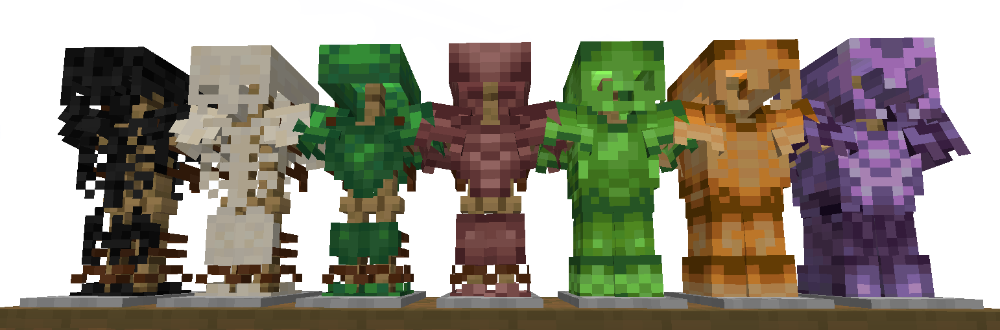

  

# <h1 align="center"> What is Combat Continuity? </h1>

---

>Combat continuity aims to fill in the missing pieces of resource usage in all things combat, whether it's armor or tools.
> 
> This is part of the Vanilla Expanded series I am working on which aims to expand upon the vanilla experience by making it feel less inconsistent.

<h2 align="center"> What is included? </h2>

---

### Armor & Tool Sets:
- [x] Copper : * Armor & Tools *
- [x] Emerald : * Armor & Tools *
- [x] Amethyst : * Armor & Tools *
- [x] Turtle Scute : * Armor *
- [x] Armadillo Scute : * Armor *
- [x] Wither Skeleton : * Armor *
- [x] Skeleton : * Armor *
- [x] Echo Shard : * Armor *

  

---

### New Items:
- [x] Echo Shard Upgrade Smithing Template : * Found in ancient city chests*
- [x] Amethyst Upgrade Smithing Template : * Found in abandoned mineshaft chests*
- [x] Withered Bone : * Dropped by wither skeletons*

---

### Advancements:
- [x] Copper Ingots : * Smelt raw copper*
- [x] Acquire Emeralds : * Obtain an emerald*
- [x] Clusters For What? : * Obtain an amethyst cluster*
- [x] Amethyst Armor? : * Obtain an amethyst smithing template*
- [x] Copper Armor : * Craft a piece of copper armor*
- [x] Hero's Wear Emeralds : * Craft a full set of emerald armor*
- [x] Covered In Crystals : * Craft a full set of Amethyst armor*
- [x] To Scute Or Not To Scute : * Obtain a turtle scute*
- [x] A Shell To Protect : * Craft a full set of turtle scute gear*
- [x] An Armadillo A Day Keeps The Mobs Away : * Craft a full set of armadillo scute gear*
- [x] I Have A Bone To Pick With You! : * Craft a full set of skeleton bone gear*
- [x] Wither Me This, Wither Me That : * Craft a full set of withered bone gear*
- [x] Deep Dark Armor? : * Obtain an echo shard smithing template*
- [x] An Echo In The Deep : * Craft a full set of echo shard armor*